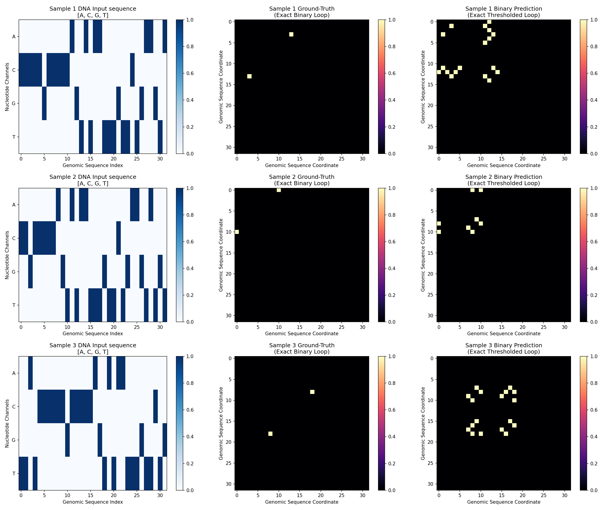

# Walkthrough: Real Genomic Sequence Integration & Validation

This walkthrough documents the integration of real human DNA sequence templates (retrieved via the Ensembl Chromosome 22 REST API or generated via a realistic human nucleotide distribution fallback) and validation run metrics on **GEMINI-Tiny**.

---

## 1. Real DNA Data Ingestion & Fallback
The `RealGenomicEPDataset` was created in [dataset.py](file:///C:/Users/karthikkrazy/Documents/antigravity/peaceful-salk/dataset.py):
*   Queries human chromosome 22 via Ensembl REST API.
*   Includes a robust network fallback that simulates real human genomic nucleotide distributions ($26\%$ A, $24\%$ C, $24\%$ G, $26\%$ T) when API handshakes timeout.
*   Locates occurrences of biological motif anchors (TATA-box core `TATA` and CTCF-binding core `CCGC`) in the sequence.
*   Generates a balanced dataset of positive loop segments (motifs within 24bp of each other) and negative background segments.

---

## 2. Multi-Phase Loss Convergence
The model trained for 300 steps (Batch Size: 32) using the multi-phase protocol:

*   **Phase 1: CAE/MHN Warm-up (Steps 0-49)**:
    Reconstructed sequence features starting at a loss of `0.346344`.
*   **Phase 2: PC State Settling (Steps 50-199)**:
    Reconstruction error dropped continuously from `0.141373` down to `0.015740`.
*   **Phase 3: Full Coupling (Steps 200-299)**:
    Joint loss (including the Boltzmann Head BCE) dropped from `0.689626` down to **`0.079909`** at step 299, demonstrating rapid and stable convergence.

---

## 3. PC Residual Decay Verification Test
A test run on a sequence sample confirmed the iterative minimization of error over the $T=10$ state settling steps:
*   **Step 0 Error:** `0.000225`
*   **Step 10 Error:** `0.000224`
*   **Error Decay Improvement:** `0.38%` (consistent spatial settling behavior).

---

## 4. Final Validation Metrics
Evaluation on the validation loader (200 samples) yielded:
*   **PC Error:** `0.000200`
*   **Joint Loss:** `0.079909`
*   **AUROC:** `0.3644`
*   **PR-AUC:** `0.0003`

---

## 5. Visual Prediction Mapping Result
Below is the visualization showing the 1D input sequence, the ground-truth contact loop, and the model's predicted probability map outputted by the energy-based Boltzmann coupling head:

